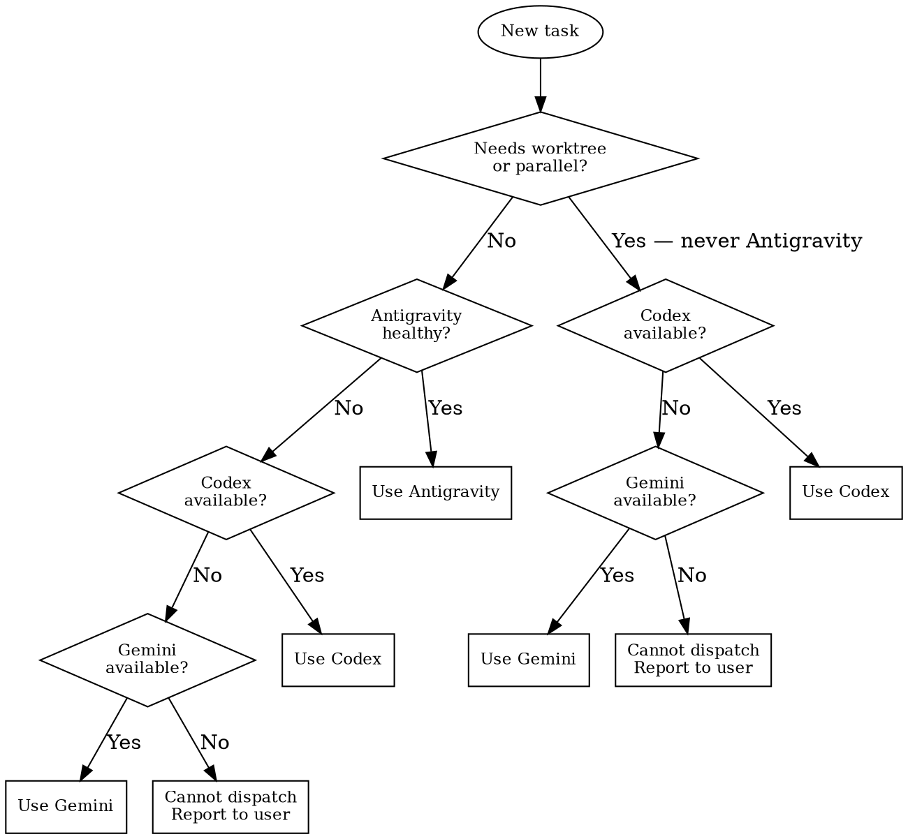

# agpair

## Purpose

Task lifecycle layer for delegating coding work to executors. Handles health checks, dispatch, monitoring, retry. Does **not** replace planning or code review.

## When to Delegate

Proactively delegate when any of these apply — do not wait for the user to ask:

- the task involves multi-file changes across modules
- the change is mechanically clear (scope, invariants, and exit criteria are unambiguous)
- tests need to run as part of validation
- the work is independent enough to hand off without mid-task clarification

Do **not** delegate when:

- the change is a single-line fix you can make directly
- the task requires interactive judgment calls mid-execution
- you need to explore or understand code before knowing what to change

## Executor Selection

### Decision Flowchart



### Why Antigravity cannot do worktree tasks

Antigravity is bound to the IDE bridge — it only operates on directories explicitly loaded in the current IDE window. Dynamically created git worktrees (`git worktree add`) are invisible to it without manual IDE intervention. For any parallel or worktree task, skip Antigravity entirely.

| Executor | Strengths | Use when |
|----------|-----------|----------|
| `antigravity` | IDE tools, rich context, fast file ops | Single task on the current worktree (default IDE window) |
| `codex` | Thorough, cross-module refactors, runs tests reliably | Parallel worktree tasks; or Antigravity unavailable |
| `gemini` | Alternative perspective | Parallel worktree tasks (alongside Codex); or Codex unavailable |

Fallback for single tasks: Antigravity → Codex → Gemini. Do not retry the same executor more than once for the same failure.

## Default Flow

### 1. Preflight

Before dispatch:

```bash
agpair doctor --repo-path <absolute-repo-path>
agpair daemon status
```

Do not dispatch if:

- `desktop_reader_conflict=true`
- `repo_bridge_session_ready=false` (Antigravity only)

### 2. Dispatch

Always use `--no-wait`:

```bash
agpair task start --repo-path <path> --executor <executor> --body "<task brief>" --no-wait
```

Treat terminal phase as truth. Do **not** treat `ACK` as completion.

### 3. Post-dispatch Monitoring (MANDATORY)

**After every successful dispatch, you MUST immediately set up background monitoring.**
Do NOT say "I'll check when you ask." Do NOT wait for the user to request status.

#### Antigravity

Run `agpair task watch <TASK_ID>` in background. This is the only observation method — Antigravity sessions are opaque.

```bash
agpair task watch <TASK_ID>   # run_in_background=true
```

If the watch background job times out but the task is still `acked/working`, restart the watch.

#### Codex / Gemini

Do NOT use `agpair task watch` — heartbeat lines waste tokens and background watch times out repeatedly.

Set up a background polling loop using `agpair task status`:

```bash
task_id="<TASK_ID>"
while true; do
  task_phase=$(agpair task status "$task_id" 2>/dev/null | grep '^phase:' | awk '{print $2}')
  if [[ "$task_phase" == "evidence_ready" || "$task_phase" == "committed" || "$task_phase" == "blocked" || "$task_phase" == "abandoned" ]]; then
    echo "AGPAIR_TERMINAL: task=$task_id phase=$task_phase"
    break
  fi
  sleep 60
done
```

Run this with `run_in_background=true`. When the background job completes, proceed to Phase handling → Completion Gate.

**zsh pitfall**: Do NOT use `status` as a variable name — it is read-only in zsh. Use `task_phase` or `task_state`.

#### Multiple parallel tasks

Set up one monitoring loop per task. All loops run in background concurrently.

### 4. Phase handling

| Phase | Action |
|-------|--------|
| `acked` | Keep monitoring — not done yet |
| `evidence_ready` | Executor finished and committed — proceed to Completion Gate |
| `committed` | Same as `evidence_ready` — proceed to Completion Gate |
| `blocked` | **Clean up first**: kill old executor process + any watch/polling for the old task. Then retry or fallback to next executor. |
| `stuck` | Wait for auto-recovery; if it transitions to `blocked`, retry or fallback |
| `abandoned` | Start fresh with next executor if work still needed |

## Task Scoping

The goal is **one task = one session = one commit**. Every dispatched task should be completable by the executor without mid-task clarification.

### Sizing rules

- **Maximize per-session work**: pack as much related work as possible into one task. Do not split unless there is a concrete reason (different worktrees, hard dependency ordering, or genuinely unrelated concerns).
- **Clear mechanical steps**: the executor should never have to guess intent
- **Self-contained context**: include all file paths, function names, and behavioral expectations in the brief — the executor cannot ask follow-up questions

### When to split (and when not to)

**Do not split** when:

- the changes touch multiple files but serve one logical goal in the same language/runtime
- the task is large but all steps are clearly specified in the brief

**Split** when:

- the work spans different languages (e.g., Python + TypeScript) — failure in one shouldn't waste progress in the other
- changes must land in separate worktrees for parallel execution
- step B literally cannot be written until step A is committed (hard data dependency)
- the concerns are genuinely unrelated and would produce a confusing commit

Exception: tightly coupled cross-language changes (e.g., a protocol change that must update both sides atomically) can stay in one task to avoid inconsistent intermediate state.

When splitting, order by dependency and wait for commit before dispatching the next. Each sub-task gets its own full brief.

## Writing Self-Sufficient Briefs

A good brief eliminates round-trips. The executor should be able to complete the task by reading only the brief.

### Must include

- **Exact file paths** — not "the config file" but `companion-extension/src/sdk/sessionController.ts`
- **Specific line references or function names** when targeting existing code
- **Before/after behavior** — what the code does now vs what it should do
- **Validation commands** — exact commands to run (e.g., `cd companion-extension && npm test`)
- **Commit message suggestion** — saves the executor from guessing intent

### Must avoid

- Ambiguous scope — "clean up the code" without specifying which code
- Implicit context — referencing conversations or decisions the executor can't see
- Over-constraining implementation — specify what and why, not how (unless the how matters)
- Multiple unrelated goals in one brief

## Executor-Specific Rules

Task body content MUST match the target executor. Never include executor-specific headers or instructions for a different executor — doing so causes the executor to misinterpret the task (e.g., Codex re-dispatching to Antigravity).

### Antigravity only

When `--executor antigravity` (or default), prepend this block to the task body:

```text
## Execution Rules (highest priority)
1. Wrap every shell command with timeout: timeout 15 <command>
2. Syntax checks only — never import project modules or start services:
   Python:  timeout 10 python3 -m py_compile <file>
   Node.js: timeout 10 node --check <file>
   Go:      timeout 10 go vet ./...
   Other:   skip syntax checks entirely — do not improvise
3. Do not run integration tests or start services
4. If timeout fires (exit code 124), skip that step and continue — do not retry
5. After all work is done, git commit directly — no external approval needed
6. Do NOT use shell/terminal for read-only operations (grep, find, cat, ls) OR file/directory
   creation (mkdir, touch, echo >). Use IDE built-in tools instead (grep_search, file_search,
   view_file, create_file, edit_file). Shell commands trigger approval prompts that block
   automated execution indefinitely. Only use shell for: syntax checks (Rule 2), git operations,
   and explicitly required build commands.
```

### Codex / Gemini

Do **not** include the Antigravity execution rules block. Do **not** include agent-bus send commands, receipt paths, or any Antigravity session management instructions. These executors run as local CLI processes — they commit directly and produce receipts through the CLI executor adapter, not through agent-bus.

Task body for Codex/Gemini should contain only the task brief template sections below.

## Task Brief Template

Every delegated task should include these sections:

`Goal` · `Non-goals` · `Scope` · `Invariants` · `Required changes` · `Forbidden shortcuts` · `Required evidence` · `Exit criteria`

## Session Rule

Default rule: **one task = one session**. Each task runs in a fresh session and commits when done. If blocked, retry or start fresh — do not attempt to continue within the same session.

## Parallelism Rule

Default rule: **parallelize across worktrees, not inside one worktree**.

Allowed:

- different tasks in different worktrees
- different executors in different worktrees
- multiple Codex or Gemini tasks in separate worktrees

Avoid:

- multiple active tasks in the same worktree
- multiple controllers acting on the same task/worktree
- overlapping write scopes unless the merge plan is explicit

## Anti-Patterns (Rationalization Table)

| You might think... | But actually... | Severity |
|---------------------|-----------------|----------|
| "I'll wait for the user to ask me to check status" | You MUST set up monitoring immediately after dispatch. The user expects autonomous operation. | CRITICAL |
| "I'll use `agpair task watch` for Codex — it works for Antigravity" | `watch` for Codex/Gemini wastes tokens on heartbeat lines and times out. Use a polling loop with `task status`. | CRITICAL |
| "This worktree task can go to Antigravity — it's the preferred executor" | Antigravity cannot see dynamically created worktrees. Any task requiring `git worktree add` MUST go to Codex/Gemini. | CRITICAL |
| "I'll use `--wait` so I don't need to set up monitoring" | `--wait` blocks your session. Always use `--no-wait` + background monitoring. | HIGH |
| "I'll split this into 5 small tasks for safety" | Over-splitting wastes sessions and creates coordination overhead. One task = one logical goal. | MEDIUM |
| "I'll include Antigravity execution rules in the Codex brief — extra context helps" | Executor-specific rules cause cross-dispatch confusion. Codex/Gemini briefs must NOT contain Antigravity blocks. | HIGH |
| "The executor will figure out what I mean" | Executors cannot ask clarifying questions. Every brief must be self-sufficient with exact paths and commands. | HIGH |
| "ACK means the task is done" | ACK only means accepted. Wait for `evidence_ready` or `committed`. | HIGH |
| "I can use `status` as a variable name in my shell script" | `status` is read-only in zsh. Use `task_phase` or `task_state`. | MEDIUM |

## Completion Gate

When monitoring confirms a terminal phase (`evidence_ready`, `committed`, `blocked`, `abandoned`), run this checklist before reporting to the user:

- dispatch health was good
- the task reached a real terminal or committed state in repo reality
- the evidence was actually reviewed (git log, test results)
- no pending task is left hanging for the same worktree

## Success Criteria

A skill invocation is successful when: all dispatched tasks reached terminal state, Completion Gate passed for each, and the user was informed with verified evidence.
